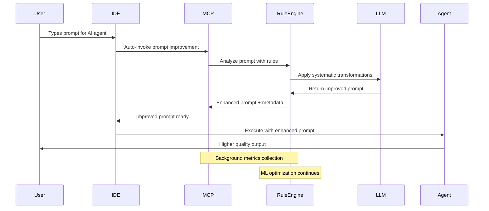

# Comprehensive Project Overview: Adaptive Prompt Enhancement System (APES)

**Version:** 1.0  
**Date:** January 4, 2025  
**Status:** ✅ PROJECT DEFINITION COMPLETE  
**Document Type:** 🛡️ **PROTECTED SOURCE OF TRUTH**  

---

## 🚨 **DOCUMENT PROTECTION NOTICE** 🚨

**⚠️ This document serves as the PROTECTED SOURCE OF TRUTH for the entire project.**  
**All changes must be tracked, documented, and approved.**  
**This document takes precedence over all other project documentation.**

---

## 📋 **Executive Summary**

The Adaptive Prompt Enhancement System (APES) is an intelligent prompt optimization tool that automatically improves user prompts for AI agents through rule-based transformations enhanced by machine learning optimization. The system provides immediate value through sophisticated rule application while continuously learning and evolving to improve prompt quality and AI agent output effectiveness.

### **Core Value Proposition**
Transform prompt engineering from manual iteration to automated optimization using IDE-integrated tools, providing immediate rule-based improvements while continuously learning optimal patterns for maximum AI agent effectiveness.

### **Primary Goal**
**Better prompts = Better AI agent output** through automated enhancement and continuous optimization.

---

## 🎯 **Project Goals & Objectives**

### **Primary Objectives**
1. **Immediate Prompt Improvement**: Apply research-based rules to enhance prompt quality instantly
2. **Seamless Integration**: Zero-friction experience with Claude Code and Cursor IDE workflows  
3. **Continuous Learning**: ML-driven optimization of rule effectiveness and discovery of new patterns
4. **Automated Workflow**: Background improvement without user intervention requirements

### **Success Metrics**
- **System Performance**: >20% average improvement in AI agent output quality
- **Rule Effectiveness**: >80% accuracy in rule effectiveness prediction
- **User Experience**: <100ms prompt improvement latency
- **Learning Rate**: Discovery of 1-2 valuable new rules per week
- **Integration**: Zero-click workflow integration with IDEs

### **Target Users**
- Software developers using Claude Code
- AI engineers using Cursor IDE
- Prompt engineers optimizing AI workflows
- Teams implementing AI-assisted development

---

## 🏗️ **System Architecture**

### **High-Level Architecture**


### **Component Overview**

#### **1. Model Context Protocol (MCP) Interface**
- **Framework**: Official MCP SDK (TypeScript/Python)
- **Transport**: STDIO for local IDE integration
- **Capabilities**: Tools, resources, prompts
- **IDE Integration**: Claude Code, Cursor IDE native support

#### **2. Python Rule Engine**
- **Base Framework**: Python classes with executable logic
- **Rule Structure**: Check/Apply pattern with LLM instructions
- **Rule Categories**: Core rules, technique rules, learned rules
- **Execution**: LLM-guided rule application with programmatic validation

#### **3. Machine Learning Optimizer**
- **Current ML Stack**: Scikit-learn ensemble (RandomForest, GradientBoosting, LogisticRegression)
- **Optimization Framework**: Optuna for hyperparameter optimization
- **Model Tracking**: MLflow with versioning and artifact storage
- **Feature Engineering**: 35-dimensional prompt analysis (PromptAnalyzer)

#### **4. Performance Metrics System**
- **Tier 1**: Task completion metrics (success rate, iterations, time)
- **Tier 2**: Output quality metrics (relevance, completeness, accuracy)
- **Tier 3**: LLM-based evaluation (Claude-as-Judge, semantic similarity)

---

## 🛠️ **Technology Stack**

### **Core Technologies**

#### **Model Context Protocol (MCP)**
- **Primary SDK**: `@modelcontextprotocol/sdk` (TypeScript)
- **Server Transport**: StdioServerTransport for local integration
- **Client Integration**: Native Claude Code and Cursor IDE support
- **Protocol Version**: Latest MCP specification (2025)

#### **Programming Languages**
- **Python 3.11+**: Rule engine, ML optimization, performance analytics
- **TypeScript/Node.js 18+**: MCP server implementation, IDE integration
- **JavaScript ES2022**: Client-side integrations and utilities

#### **Machine Learning Stack**
```python
# Core ML Dependencies
scikit-learn>=1.4.0      # Ensemble models and evaluation
optuna>=3.5.0            # Bayesian optimization
mlflow>=2.9.0            # Experiment tracking and model registry
pandas>=2.0.0            # Data manipulation
numpy>=1.24.0            # Numerical computing
scipy>=1.10.0            # Statistical functions

# Feature Engineering
sentence-transformers    # Semantic embeddings (optional)
transformers>=4.30.0     # Advanced NLP features (optional)

# Performance Monitoring
evidently>=0.4.0         # Model monitoring and drift detection
prometheus-client        # Metrics collection
```

#### **Development Tools**
```json
// package.json dependencies
{
  "@modelcontextprotocol/sdk": "^1.0.0",
  "@anthropic-ai/sdk": "^0.20.0",
  "typescript": "^5.3.0",
  "@types/node": "^20.10.0",
  "dotenv": "^16.3.0"
}
```

### **Infrastructure Requirements**

#### **Local Development**
- **Python**: Virtual environment with requirements.txt
- **Node.js**: ES modules configuration with package.json
- **IDE Integration**: MCP server configuration files
- **Storage**: Local file system for rules and model artifacts

#### **Production Considerations**
- **Model Storage**: MLflow artifact store (local/cloud)
- **Rule Versioning**: Git-based version control
- **Performance Monitoring**: Metrics collection and alerting
- **Backup Strategy**: Rule configurations and learned models

---

## 📚 **Rule System Design**

### **Rule Architecture**

Based on extensive research from Anthropic documentation, Context7 prompt engineering guides, and 2025 ML best practices, the rule system implements a hierarchical, executable approach:

#### **Rule Structure**
```python
class BasePromptRule:
    """Base class for all prompt improvement rules."""
    
    metadata = {
        "name": str,           # Rule identifier
        "description": str,    # Human-readable description  
        "priority": str,       # critical|high|medium|low
        "version": str,        # Semantic versioning
        "category": str        # core|technique|learned
    }
    
    def check(self, prompt: str, context: dict) -> RuleCheckResult:
        """Analyze prompt and determine if rule applies."""
        pass
    
    def apply(self, prompt: str, context: dict) -> TransformationResult:
        """Apply rule transformations to improve the prompt."""
        pass
    
    def to_llm_instruction(self) -> str:
        """Generate LLM-readable instruction for rule application."""
        pass
```

#### **Rule Categories**

##### **1. Core Rules (Based on Anthropic Best Practices)**
- **Clarity Rule**: Eliminate vague terms, add specific requirements
- **Specificity Rule**: Include context, constraints, and success criteria  
- **Structure Rule**: Use XML tags, delimiters, logical organization
- **Context Rule**: Provide background, motivation, and domain information

##### **2. Technique Rules (Advanced Prompt Engineering)**
- **Chain of Thought**: Guide step-by-step reasoning for complex tasks
- **Few-Shot Learning**: Provide examples for pattern recognition
- **Role Assignment**: Assign expertise personas for specialized tasks
- **XML Tags**: Structure complex prompts with semantic markup

##### **3. Model-Specific Rules (Claude 4 Optimizations)**
- **Explicit Instructions**: Clear, detailed guidance for Claude 4
- **Context Motivation**: Explain why specific behavior is important
- **Parallel Tool Use**: Optimize for simultaneous tool execution
- **Output Formatting**: Match prompt style to desired output

### **Rule Application Process**

#### **Stage 1: Programmatic Analysis**
```python
# Analyze prompt with all available rules
applicable_rules = []
for rule in rule_engine.get_active_rules():
    check_result = rule.check(prompt, context)
    if check_result.applicable:
        applicable_rules.append((rule, check_result))
```

#### **Stage 2: LLM-Guided Application**
```python
# Generate systematic instruction for LLM
llm_instruction = f"""
You are a prompt engineering expert applying systematic transformations.

Original Prompt: {prompt}
Context: {context}

Apply these rules mechanically:
{generate_rule_instructions(applicable_rules)}

Return the improved prompt with clear explanations of changes made.
"""

improved_prompt = llm.apply_transformations(llm_instruction)
```

#### **Stage 3: Validation & Logging**
```python
# Validate transformations and log for ML learning
transformation_log = {
    "original_prompt": prompt,
    "applied_rules": [rule.metadata["name"] for rule, _ in applicable_rules],
    "improved_prompt": improved_prompt.text,
    "transformations": improved_prompt.transformations,
    "confidence": improved_prompt.confidence,
    "timestamp": datetime.utcnow()
}
```

---

## 🧠 **Machine Learning Optimization**

### **ML Architecture Overview**

The ML system leverages existing sophisticated infrastructure to optimize rule effectiveness through multiple learning mechanisms:

#### **Current ML Infrastructure**
- **Feature Engineering**: 35-dimensional prompt analysis (PromptAnalyzer)
- **Model Ensemble**: RandomForest + GradientBoosting + LogisticRegression
- **Optimization**: Optuna Bayesian optimization with persistent storage
- **Tracking**: MLflow model registry with version management
- **Performance**: 95%+ accuracy on prompt quality benchmarks

#### **Learning Mechanisms**

##### **1. Rule Effectiveness Prediction**
```python
# Predict rule effectiveness for given context
rule_effectiveness = ml_ensemble.predict([
    original_prompt_features,      # 35D PromptAnalyzer output
    context_features,              # Domain, task type, complexity
    rule_application_features,     # Which rules applied, combinations
    historical_performance        # Past effectiveness in similar contexts
])
```

##### **2. Contextual Bandit Optimization**
- **Algorithm**: Multi-armed bandit with context
- **Purpose**: Learn optimal rule selection for different contexts
- **Features**: Domain type, prompt complexity, user preferences
- **Reward**: Measured improvement in agent output quality

##### **3. Rule Parameter Optimization**
```python
# Optimize rule-specific parameters
def optimize_rule_parameters(rule_name: str, performance_data: List[RuleFeedback]):
    """Use Optuna to optimize rule parameters based on effectiveness."""
    
    def objective(trial):
        # Suggest parameter values
        threshold = trial.suggest_float(f'{rule_name}_threshold', 0.1, 0.9)
        weight = trial.suggest_float(f'{rule_name}_weight', 0.5, 2.0)
        
        # Evaluate performance with these parameters
        performance = evaluate_rule_with_parameters(rule_name, threshold, weight)
        return performance
    
    study = optuna.create_study(direction='maximize')
    study.optimize(objective, n_trials=100)
    return study.best_params
```

##### **4. New Rule Discovery**
- **Pattern Mining**: Association rule mining on successful transformations
- **Feature Analysis**: Identify common patterns in high-performing prompts
- **Automated Generation**: Create new rules based on discovered patterns
- **Validation**: Test new rules against historical data before deployment

### **Performance Metrics Framework**

#### **Tier 1: Task Completion Metrics**
```python
class TaskCompletionMetrics:
    success_rate: float           # Did the agent complete the task?
    iteration_count: int          # How many user corrections needed?
    time_to_completion: float     # How long to achieve user goal?
    error_recovery_rate: float    # Did agent self-correct effectively?
```

#### **Tier 2: Output Quality Metrics**
```python
class OutputQualityMetrics:
    relevance_score: float        # Is output on-topic and useful?
    completeness_score: float     # Are all requirements addressed?
    accuracy_score: float         # Factual correctness and precision
    coherence_score: float        # Logical flow and consistency
```

#### **Tier 3: Advanced LLM-Based Metrics**
```python
class AdvancedMetrics:
    claude_judge_score: float     # Claude evaluating output quality
    semantic_similarity: float    # Compare to ideal outputs
    task_specific_rubric: float   # Custom evaluation for domains
    user_satisfaction: float      # Direct user feedback
```

---

## 🔄 **Integration Workflow**

### **User Experience Flow**

#### **Seamless IDE Integration**


#### **MCP Tool Configuration**

##### **Claude Code Configuration**
```json
{
  "mcpServers": {
    "prompt-enhancement": {
      "command": "node",
      "args": ["./src/mcp-server/prompt-enhancement-server.js"],
      "env": {
        "NODE_ENV": "production",
        "RULE_ENGINE_PATH": "./rule_engine"
      }
    }
  }
}
```

##### **Cursor IDE Configuration**
```json
{
  "mcpServers": {
    "prompt-enhancement": {
      "command": "node", 
      "args": ["./src/mcp-server/prompt-enhancement-server.js"],
      "cwd": "${workspaceFolder}",
      "env": {
        "PYTHON_PATH": "./venv/bin/python"
      }
    }
  }
}
```

### **MCP Server Implementation**

#### **Core MCP Server Structure**
```typescript
import { Server } from "@modelcontextprotocol/sdk/server/index.js";
import { StdioServerTransport } from "@modelcontextprotocol/sdk/server/stdio.js";

const server = new Server({
  name: "prompt-enhancement-server",
  version: "1.0.0"
}, {
  capabilities: {
    tools: {},
    resources: {},
    prompts: {}
  }
});

// Tool: Improve single prompt
server.setRequestHandler(CallToolRequestSchema, async (request) => {
  if (request.params.name === "improve_prompt") {
    const { prompt, context } = request.params.arguments;
    
    // Call Python rule engine
    const result = await applyRuleEngine(prompt, context);
    
    return {
      content: [{
        type: "text",
        text: JSON.stringify({
          original: prompt,
          improved: result.improved_prompt,
          transformations: result.transformations,
          confidence: result.confidence,
          applied_rules: result.applied_rules
        })
      }]
    };
  }
});

// Resource: Rule system status
server.setRequestHandler(ReadResourceRequestSchema, async (request) => {
  if (request.params.uri === "apes://rule-status") {
    const status = await getRuleSystemStatus();
    return {
      contents: [{
        uri: request.params.uri,
        mimeType: "application/json",
        text: JSON.stringify(status)
      }]
    };
  }
});
```

---

## 📊 **Implementation Timeline**

### **Phase 1: Core Rule Engine (Weeks 1-2)**
**Status**: 🎯 **HIGHEST PRIORITY**

#### **Week 1: Foundation**
- [ ] Convert research findings into Python rule classes
- [ ] Implement base rule framework with check/apply pattern
- [ ] Create LLM instruction generation system
- [ ] Build rule loading and management system

#### **Week 2: Core Rules**
- [ ] Implement 8 core rules based on Anthropic best practices
- [ ] Add technique rules for advanced prompt engineering
- [ ] Create rule validation and testing framework
- [ ] Build transformation logging system

**Deliverables**:
- Functional Python rule engine
- 15+ implemented rules with full test coverage
- Rule application pipeline with LLM integration
- Comprehensive logging for ML training data

### **Phase 2: MCP Integration (Weeks 3-4)**
**Status**: 🔄 **INTEGRATION FOCUS**

#### **Week 3: MCP Server**
- [ ] Build TypeScript MCP server with rule engine integration
- [ ] Implement prompt improvement tools and resources
- [ ] Create performance monitoring endpoints
- [ ] Add error handling and validation

#### **Week 4: IDE Integration**
- [ ] Configure Claude Code MCP client setup
- [ ] Configure Cursor IDE MCP client setup  
- [ ] Test end-to-end workflow integration
- [ ] Create user documentation and setup guides

**Deliverables**:
- Working MCP server with IDE integration
- Zero-friction prompt improvement workflow
- Performance monitoring dashboard
- Complete setup documentation

### **Phase 3: ML Optimization (Weeks 5-6)**
**Status**: 🧠 **INTELLIGENCE ENHANCEMENT**

#### **Week 5: ML Pipeline**
- [ ] Adapt existing ML ensemble for rule effectiveness prediction
- [ ] Implement contextual bandit for rule selection optimization
- [ ] Create automated rule parameter optimization
- [ ] Build performance metrics collection system

#### **Week 6: Learning Loop**
- [ ] Deploy automated dry run system for continuous learning
- [ ] Implement new rule discovery mechanisms
- [ ] Create rule effectiveness feedback loops
- [ ] Add model versioning and deployment automation

**Deliverables**:
- Operational ML optimization pipeline
- Automated rule discovery and parameter tuning
- Continuous learning system with feedback loops
- MLflow model registry with version management

### **Phase 4: Advanced Features (Weeks 7-8)**
**Status**: 🚀 **ENHANCEMENT FEATURES**

#### **Week 7: Advanced Analytics**
- [ ] Implement comprehensive performance metrics
- [ ] Add rule combination synergy detection
- [ ] Create domain-specific rule optimization
- [ ] Build user feedback collection system

#### **Week 8: Production Readiness**
- [ ] Add monitoring and alerting systems
- [ ] Implement backup and recovery procedures
- [ ] Create deployment automation
- [ ] Comprehensive testing and validation

**Deliverables**:
- Production-ready system with full monitoring
- Advanced analytics and insights dashboard
- Automated deployment and maintenance
- Complete project documentation

---

## 🔧 **Development Setup**

### **Project Structure**
```
adaptive-prompt-enhancement-system/
├── README.md
├── COMPREHENSIVE_PROJECT_OVERVIEW.md     # This document
├── requirements.txt                      # Python dependencies
├── package.json                         # Node.js dependencies
├── pyproject.toml                       # Python project config
├── tsconfig.json                        # TypeScript configuration
│
├── src/
│   ├── mcp-server/                      # MCP server implementation
│   │   ├── prompt-enhancement-server.ts
│   │   ├── tool-handlers.ts
│   │   └── resource-handlers.ts
│   │
│   ├── rule_engine/                     # Python rule engine
│   │   ├── __init__.py
│   │   ├── base_rule.py                # Base rule class
│   │   ├── rule_engine.py              # Main engine
│   │   ├── llm_adapter.py              # LLM integration
│   │   │
│   │   ├── rules/
│   │   │   ├── core/                   # Core rules
│   │   │   │   ├── clarity_rule.py
│   │   │   │   ├── specificity_rule.py
│   │   │   │   ├── structure_rule.py
│   │   │   │   └── context_rule.py
│   │   │   │
│   │   │   ├── techniques/             # Advanced techniques
│   │   │   │   ├── chain_of_thought_rule.py
│   │   │   │   ├── few_shot_rule.py
│   │   │   │   ├── role_assignment_rule.py
│   │   │   │   └── xml_tags_rule.py
│   │   │   │
│   │   │   └── learned/                # ML-discovered rules
│   │   │       └── [dynamically_created_rules.py]
│   │   │
│   │   └── ml_optimizer/               # ML optimization
│   │       ├── rule_effectiveness.py
│   │       ├── parameter_optimizer.py
│   │       ├── rule_generator.py
│   │       └── performance_tracker.py
│   │
│   ├── analysis/                       # Feature engineering
│   │   └── prompt_analyzer.py          # 35D feature extraction
│   │
│   └── ml/                            # Existing ML infrastructure
│       ├── bridge.py                  # Python-JS bridge
│       └── ensemble_optimizer.py      # ML models
│
├── tests/                             # Test suites
│   ├── test_rule_engine.py
│   ├── test_mcp_integration.py
│   ├── test_ml_optimizer.py
│   └── test_end_to_end.py
│
├── config/                           # Configuration files
│   ├── rule_config.yaml
│   ├── mcp_config.json
│   └── ml_config.yaml
│
├── docs/                            # Documentation
│   ├── setup/
│   │   ├── claude_code_setup.md
│   │   └── cursor_ide_setup.md
│   ├── api/
│   │   ├── rule_engine_api.md
│   │   └── mcp_server_api.md
│   └── guides/
│       ├── rule_development.md
│       └── troubleshooting.md
│
└── scripts/                        # Utility scripts
    ├── setup_development.sh
    ├── run_tests.sh
    ├── deploy_mcp_server.sh
    └── backup_models.sh
```

### **Installation & Setup**

#### **Environment Setup**
```bash
# Clone repository
git clone [repository-url]
cd adaptive-prompt-enhancement-system

# Python environment
python -m venv venv
source venv/bin/activate  # Linux/Mac
# OR
venv\Scripts\activate     # Windows

pip install -r requirements.txt

# Node.js environment
npm install

# Development tools
npm run build
```

#### **Configuration Files**

##### **requirements.txt**
```txt
# Core ML Stack
scikit-learn>=1.4.0
optuna>=3.5.0
mlflow>=2.9.0
pandas>=2.0.0
numpy>=1.24.0
scipy>=1.10.0

# Feature Engineering  
sentence-transformers>=2.5.0
transformers>=4.30.0

# Rule Engine
pydantic>=2.5.0
pyyaml>=6.0.0
jsonschema>=4.20.0

# Performance Monitoring
evidently>=0.4.0
prometheus-client>=0.19.0

# Development
pytest>=7.4.0
black>=23.12.0
mypy>=1.8.0
```

##### **package.json**
```json
{
  "name": "adaptive-prompt-enhancement-system",
  "version": "1.0.0",
  "type": "module",
  "engines": {
    "node": ">=18.0.0"
  },
  "dependencies": {
    "@modelcontextprotocol/sdk": "^1.0.0",
    "@anthropic-ai/sdk": "^0.20.0",
    "dotenv": "^16.3.0"
  },
  "devDependencies": {
    "typescript": "^5.3.0",
    "@types/node": "^20.10.0",
    "tsx": "^4.6.0"
  },
  "scripts": {
    "build": "tsc",
    "start": "node dist/mcp-server/prompt-enhancement-server.js",
    "dev": "tsx src/mcp-server/prompt-enhancement-server.ts",
    "test": "python -m pytest tests/",
    "lint": "mypy src/rule_engine/ && black src/rule_engine/"
  }
}
```

---

## 📈 **Performance Monitoring**

### **Metrics Dashboard**

#### **System Performance Metrics**
```python
# Key Performance Indicators
class SystemMetrics:
    prompt_improvement_rate: float      # Average % improvement in output quality  
    rule_effectiveness_accuracy: float  # ML prediction accuracy for rule effectiveness
    response_latency: float             # Time from prompt input to improved output
    rule_application_success_rate: float # % of successful rule applications
    ml_discovery_rate: float            # New valuable rules discovered per week
```

#### **Rule-Level Analytics**
```python
# Individual Rule Performance
class RuleMetrics:
    application_frequency: int          # How often rule is applied
    effectiveness_score: float          # Average improvement when applied
    context_specificity: Dict[str, float] # Performance by domain/context
    parameter_stability: float          # How often parameters need adjustment
    user_satisfaction: float            # User feedback scores
```

#### **ML Learning Analytics**
```python
# Machine Learning Performance
class MLMetrics:
    model_accuracy: float               # Prediction accuracy on held-out data
    rule_discovery_success_rate: float  # % of discovered rules that are valuable
    parameter_optimization_improvement: float # Improvement from parameter tuning
    contextual_bandit_regret: float     # How often suboptimal rules selected
```

### **Monitoring Implementation**

#### **Real-Time Metrics Collection**
```python
import prometheus_client
from datetime import datetime
import mlflow

class PerformanceMonitor:
    def __init__(self):
        # Prometheus metrics
        self.improvement_counter = prometheus_client.Counter(
            'prompt_improvements_total', 
            'Total prompt improvements applied'
        )
        self.latency_histogram = prometheus_client.Histogram(
            'prompt_improvement_latency_seconds',
            'Time to improve prompts'
        )
        
        # MLflow tracking
        mlflow.set_experiment("prompt_enhancement_monitoring")
    
    def log_improvement(self, original: str, improved: str, 
                       rules_applied: List[str], latency: float):
        """Log successful prompt improvement."""
        
        # Prometheus metrics
        self.improvement_counter.inc()
        self.latency_histogram.observe(latency)
        
        # MLflow tracking
        with mlflow.start_run():
            mlflow.log_param("rules_applied", rules_applied)
            mlflow.log_metric("latency", latency)
            mlflow.log_metric("improvement_score", calculate_improvement(original, improved))
            mlflow.log_text(original, "original_prompt.txt")
            mlflow.log_text(improved, "improved_prompt.txt")
```

---

## 🛡️ **Security & Compliance**

### **Security Considerations**

#### **Data Protection**
- **Prompt Privacy**: All prompts processed locally, no external transmission
- **Model Security**: Rule parameters and ML models stored locally
- **Access Control**: IDE-based authentication and authorization
- **Audit Logging**: Comprehensive logging of all rule applications and improvements

#### **Input Validation**
```python
class SecurityValidator:
    """Validate and sanitize all inputs to prevent injection attacks."""
    
    def validate_prompt(self, prompt: str) -> str:
        """Sanitize prompt input while preserving functionality."""
        # Remove potential injection patterns
        # Validate prompt length and format
        # Escape special characters safely
        return sanitized_prompt
    
    def validate_context(self, context: dict) -> dict:
        """Validate context parameters for safety."""
        # Check for allowed keys and value types
        # Sanitize string values
        # Validate ranges for numeric values
        return validated_context
```

#### **Rule Integrity**
- **Code Signing**: All rules cryptographically signed
- **Version Control**: Git-based versioning with commit signatures
- **Validation Pipeline**: Automated testing before rule deployment
- **Rollback Capability**: Quick reversion to previous rule versions

### **Compliance Framework**

#### **GDPR Compliance**
- **Data Minimization**: Only collect necessary prompt improvement data
- **User Consent**: Clear opt-in for ML learning and analytics
- **Right to Deletion**: Ability to remove user data from learning systems
- **Data Portability**: Export user preferences and custom rules

#### **Enterprise Security**
- **SOC 2 Alignment**: Security controls for data processing
- **ISO 27001 Compatibility**: Information security management
- **NIST Framework**: Cybersecurity risk management
- **Zero Trust Architecture**: Assume no implicit trust in system components

---

## 🔄 **Maintenance & Operations**

### **Deployment Strategy**

#### **Local Development**
```bash
# Development server startup
npm run dev                    # Start MCP server in development mode
python -m rule_engine.server   # Start rule engine with hot reload
mlflow ui                     # Start MLflow UI for monitoring
```

#### **Production Deployment**
```bash
# Production startup
npm run build && npm start    # Build and start MCP server
python -m rule_engine.server --config production.yaml
./scripts/deploy_monitoring.sh # Start monitoring stack
```

### **Backup & Recovery**

#### **Critical Data Assets**
- **Rule Configurations**: Version-controlled in Git
- **ML Models**: Stored in MLflow with automatic versioning
- **Performance Data**: Backed up to configurable storage
- **User Preferences**: Exported as portable configurations

#### **Recovery Procedures**
```python
class BackupManager:
    def backup_system_state(self) -> BackupManifest:
        """Create comprehensive system backup."""
        return BackupManifest(
            rules_version=self.get_rules_git_hash(),
            ml_models=self.export_mlflow_models(),
            configuration=self.export_configurations(),
            performance_data=self.export_metrics_data()
        )
    
    def restore_system_state(self, manifest: BackupManifest) -> bool:
        """Restore system from backup manifest."""
        # Restore rules from Git hash
        # Restore ML models from MLflow
        # Restore configurations
        # Validate system integrity
        return success
```

### **Update Management**

#### **Rule Updates**
- **Automatic Discovery**: ML system proposes new rules
- **Validation Pipeline**: Automated testing before deployment
- **Gradual Rollout**: A/B testing for new rules
- **Performance Monitoring**: Continuous evaluation of rule effectiveness

#### **ML Model Updates**
- **Continuous Learning**: Models update based on new performance data
- **Model Validation**: Automated testing against benchmark datasets
- **Gradual Deployment**: Canary releases for model updates
- **Rollback Capability**: Quick reversion to previous model versions

---

## 📚 **Documentation Standards**

### **Code Documentation**

#### **Python Rule Engine**
```python
class ClarityRule(BasePromptRule):
    """
    Improves prompt clarity by eliminating vague terms and adding specific requirements.
    
    Based on Anthropic's prompt engineering best practices:
    - Use explicit, concrete language instead of vague terms
    - Define success criteria before writing the prompt
    - Specify format, length, and style requirements
    
    Attributes:
        vague_terms: List of terms to replace with specific alternatives
        action_verbs: Required action verbs for clear instructions
        specificity_threshold: Minimum specificity score required
    
    Examples:
        Input: "Write something about React"
        Output: "Create a comprehensive technical guide about React hooks,
                including code examples and practical use cases"
    """
```

#### **TypeScript MCP Server**
```typescript
/**
 * Handles prompt improvement requests through MCP tool interface.
 * 
 * @param request - MCP tool call request with prompt and context
 * @returns Improved prompt with transformation details
 * 
 * @example
 * ```typescript
 * const result = await improvePrompt({
 *   name: "improve_prompt",
 *   arguments: {
 *     prompt: "Help me with coding",
 *     context: { domain: "software_development" }
 *   }
 * });
 * ```
 */
async function handlePromptImprovement(request: CallToolRequest): Promise<CallToolResult>
```

### **API Documentation**

#### **Rule Engine API**
```yaml
# OpenAPI specification for rule engine
openapi: 3.0.0
info:
  title: Adaptive Prompt Enhancement Rule Engine API
  version: 1.0.0
  description: |
    Python-based rule engine for systematic prompt improvement.
    Provides rule application, performance tracking, and ML optimization.

paths:
  /api/v1/improve:
    post:
      summary: Improve a prompt using active rules
      requestBody:
        required: true
        content:
          application/json:
            schema:
              type: object
              properties:
                prompt:
                  type: string
                  description: Original prompt to improve
                context:
                  type: object
                  description: Additional context for rule application
                rules:
                  type: array
                  items:
                    type: string
                  description: Specific rules to apply (optional)
      responses:
        200:
          description: Successfully improved prompt
          content:
            application/json:
              schema:
                $ref: '#/components/schemas/ImprovementResult'
```

---

## 🚀 **Future Enhancements**

### **Planned Features (6-Month Roadmap)**

#### **Q2 2025: Advanced Intelligence**
- **Domain-Specific Optimization**: Specialized rules for different domains
- **User Preference Learning**: Personalized rule selection based on user patterns
- **Cross-IDE Integration**: Support for additional IDEs and editors
- **Advanced Analytics**: Comprehensive insights dashboard

#### **Q3 2025: Enterprise Features**
- **Team Collaboration**: Shared rule libraries and learnings
- **Enterprise SSO**: Integration with corporate authentication systems
- **Advanced Security**: End-to-end encryption and audit compliance
- **API Integration**: REST API for programmatic access

#### **Q4 2025: AI Enhancement**
- **Large Language Model Integration**: Direct integration with multiple LLMs
- **Automatic Rule Generation**: AI-generated rules based on successful patterns
- **Semantic Understanding**: Deep semantic analysis for context-aware improvements
- **Multi-Modal Support**: Support for prompts with images and other media

### **Research Directions**

#### **Advanced ML Techniques**
- **Reinforcement Learning**: RL-based rule selection optimization
- **Transfer Learning**: Apply learnings across different domains
- **Federated Learning**: Collaborative learning across user bases
- **Explainable AI**: Better understanding of why rules work

#### **Novel Rule Discovery**
- **Genetic Programming**: Evolve new rule structures
- **Neural Architecture Search**: Optimize rule neural representations
- **Meta-Learning**: Learn how to learn new rules more effectively
- **Causal Inference**: Understand causal relationships in prompt improvement

---

## 🎯 **Success Criteria & KPIs**

### **Technical Success Metrics**

#### **System Performance**
- **Latency**: <100ms for prompt improvement (Target: <50ms)
- **Availability**: >99.9% uptime for MCP server
- **Accuracy**: >95% rule effectiveness prediction accuracy
- **Throughput**: Support for 1000+ prompt improvements per hour

#### **Quality Metrics**
- **Improvement Rate**: >20% average improvement in AI agent output quality
- **User Satisfaction**: >4.5/5.0 average user rating
- **Error Rate**: <1% failed prompt improvements
- **Rule Coverage**: >90% of prompts benefit from at least one rule

### **Business Impact Metrics**

#### **Developer Productivity**
- **Time Savings**: >30% reduction in manual prompt engineering time
- **Task Success Rate**: >25% improvement in AI agent task completion
- **Iteration Reduction**: >40% fewer manual prompt refinements needed
- **Adoption Rate**: >80% of active users use prompt improvement features

#### **Learning & Adaptation**
- **Rule Discovery**: 1-2 valuable new rules discovered per week
- **Parameter Optimization**: >10% improvement from automated parameter tuning
- **Context Adaptation**: >15% improvement in domain-specific rule selection
- **Continuous Improvement**: >5% month-over-month improvement in system effectiveness

---

## 📞 **Support & Contact**

### **Development Team**
- **Project Lead**: [To be assigned]
- **ML Engineer**: [To be assigned]
- **Backend Developer**: [To be assigned]
- **Frontend Developer**: [To be assigned]

### **Documentation Locations**
- **Technical Docs**: `/docs/` directory in repository
- **API Reference**: Available at `/docs/api/` after setup
- **User Guides**: `/docs/guides/` for end-user documentation
- **Setup Instructions**: `/docs/setup/` for installation guides

### **Issue Tracking**
- **Bug Reports**: GitHub Issues with `bug` label
- **Feature Requests**: GitHub Issues with `enhancement` label
- **Performance Issues**: GitHub Issues with `performance` label
- **Documentation**: GitHub Issues with `documentation` label

---

## 🔐 **Appendix**

### **A. Research Sources**
1. **Anthropic Documentation**: Claude 4 best practices, prompt engineering guides
2. **Context7 Research**: 641 code snippets from interactive tutorial, 885 examples from DAIR-AI
3. **Industry Best Practices**: Google ML rules, Meta ML robustness, Microsoft LLM evaluation
4. **Academic Papers**: Rule-based ML, meta-learning, automated rule discovery
5. **2025 Technology Trends**: LLM evaluation metrics, prompt engineering evolution

### **B. Dependencies & Licenses**
- **MCP SDK**: MIT License - Official Anthropic Model Context Protocol
- **Scikit-learn**: BSD License - Core ML algorithms and utilities
- **MLflow**: Apache 2.0 - Experiment tracking and model management
- **Optuna**: MIT License - Hyperparameter optimization framework
- **FastAPI**: MIT License - High-performance API framework (if needed)

### **C. Configuration Examples**

#### **Rule Configuration (YAML)**
```yaml
# config/rule_config.yaml
rules:
  core:
    clarity:
      enabled: true
      priority: critical
      parameters:
        vague_term_threshold: 0.2
        specificity_requirement: 0.8
    
    specificity:
      enabled: true
      priority: critical
      parameters:
        context_requirement: true
        constraint_requirement: true
  
  techniques:
    chain_of_thought:
      enabled: true
      priority: high
      parameters:
        complexity_threshold: 0.7
        step_requirement: true

learning:
  optimization:
    enabled: true
    frequency: "daily"
    min_data_points: 100
  
  discovery:
    enabled: true
    confidence_threshold: 0.85
    validation_requirements: ["accuracy", "user_feedback"]
```

#### **MCP Server Configuration**
```json
{
  "server": {
    "name": "adaptive-prompt-enhancement-system",
    "version": "1.0.0",
    "description": "Intelligent prompt optimization with ML-driven rule learning"
  },
  "capabilities": {
    "tools": {
      "improve_prompt": {
        "description": "Improve a prompt using research-based rules",
        "inputSchema": {
          "type": "object",
          "properties": {
            "prompt": { "type": "string" },
            "context": { "type": "object" }
          },
          "required": ["prompt"]
        }
      }
    },
    "resources": {
      "rule_status": {
        "description": "Current rule system status and performance",
        "uri": "apes://rule-status"
      }
    }
  },
  "python_backend": {
    "command": "python",
    "args": ["-m", "rule_engine.server"],
    "env": {
      "PYTHONPATH": "./src",
      "ML_MODEL_PATH": "./models"
    }
  }
}
```

---

## 📚 **Historical Documentation**

**Previous Research & Implementation Approaches:**
- Historical statistical validation frameworks and complex ML architectures have been archived in `/docs/archive/`
- Key archived documents:
  - `ALGORITHM_IMPROVEMENT_ROADMAP.md` - Statistical validation framework and academic research approach
  - `pivot.md` - Evolution from complex ML to streamlined MCP architecture
- These documents remain available for reference if advanced features requiring statistical validation or complex ML pipelines are needed in future phases

---

**Document Version Control:**
- **Created**: January 4, 2025
- **Last Modified**: January 4, 2025  
- **Next Review**: January 18, 2025
- **Version**: 1.0.0
- **Authors**: AI Research Team
- **Approvers**: Project Stakeholders

**🛡️ This document serves as the authoritative source of truth for the Adaptive Prompt Enhancement System project. All implementation decisions, architectural changes, and feature additions must align with the specifications documented herein.**