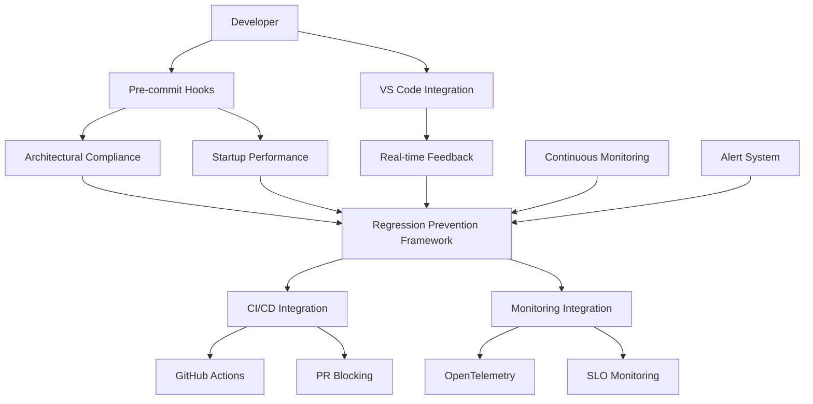

# Performance Regression Prevention Framework

A comprehensive monitoring and prevention system for architectural violations that could reintroduce performance degradation.

## Overview

This framework protects the major architectural performance improvements achieved:
- **92.4% startup improvement** through dependency optimization
- **Elimination of 134-1007ms startup penalties** from database protocol violations  
- **100% TYPE_CHECKING compliance** across 9 protocol domains
- **Zero tolerance** for critical architectural violations

## Architecture



## Components

### 1. Architectural Compliance Monitor (`architectural_compliance.py`)

Monitors for architectural violations across protocol files:

```python
from prompt_improver.monitoring.regression import ArchitecturalComplianceMonitor

monitor = ArchitecturalComplianceMonitor()
report = await monitor.check_compliance(strict=True)

print(f"Compliance: {report.compliance_ratio:.1%}")
print(f"Violations: {len(report.violations)}")
print(f"Startup penalty: {report.startup_penalty_estimate_ms}ms")
```

**Key Features:**
- **TYPE_CHECKING Compliance**: Ensures heavy imports are behind TYPE_CHECKING guards
- **Protocol File Monitoring**: 100% compliance across 9 consolidated domains
- **Circular Import Detection**: Prevents dependency cycles
- **God Object Detection**: Enforces <500 line class limit
- **Impact Estimation**: Calculates performance penalty estimates

**Protected Violations:**
- Direct heavy imports (sqlalchemy, asyncpg, torch, pandas, numpy)
- Missing TYPE_CHECKING guards in protocol files
- Circular imports between modules
- Classes exceeding 500 lines (god objects)

### 2. Startup Performance Tracker (`startup_performance.py`)

Monitors application startup performance and dependency loading:

```python
from prompt_improver.monitoring.regression import StartupPerformanceTracker

tracker = StartupPerformanceTracker()

with tracker.monitor_startup("my_app") as profile:
    # Application startup code here
    import my_heavy_module

summary = tracker.get_performance_summary()
print(f"Startup time: {summary['latest_startup']['duration_seconds']:.3f}s")
```

**Key Features:**
- **Import Chain Monitoring**: Tracks every import with timing and memory usage
- **Dependency Contamination Detection**: Alerts on prohibited dependencies in startup
- **Memory Usage Tracking**: Monitors memory allocation during startup
- **Performance Thresholds**: Enforces <500ms startup time target
- **Slow Import Analysis**: Identifies imports taking >50ms

**Performance Targets (Python 2025):**
- Total startup: <500ms
- Single import: <100ms  
- Memory usage: <100MB
- Heavy imports: ≤3 maximum

### 3. Unified Regression Prevention Framework (`regression_prevention.py`)

Main orchestrator that ties all components together:

```python
from prompt_improver.monitoring.regression import RegressionPreventionFramework

framework = RegressionPreventionFramework()

# Comprehensive regression check
report = await framework.check_for_regressions()
print(f"Status: {report.overall_status}")
print(f"Health: {report.framework_health:.1%}")

# PR validation
should_approve, validation = await framework.validate_pr_changes(changed_files)
```

**Key Features:**
- **Zero-tolerance Policy**: Blocks critical violations automatically
- **Comprehensive Reporting**: Unified view of all regression risks
- **Alert Management**: Generates actionable alerts with recommendations
- **Integration Ready**: Works with existing OpenTelemetry/SLO monitoring
- **Health Scoring**: 0-100% framework health calculation

### 4. CI/CD Integration (`ci_integration.py`)

Automated regression prevention in development workflow:

```python
from prompt_improver.monitoring.regression import CIIntegration

ci = CIIntegration()

# Install pre-commit hooks
ci.install_pre_commit_hooks()

# Install GitHub Actions workflow
ci.install_github_workflow()

# Validate PR changes
should_approve, report = await ci.run_pre_commit_check(changed_files, strict=True)
```

**Key Features:**
- **Pre-commit Hooks**: Block commits with architectural violations
- **GitHub Actions**: Automated PR validation and reporting
- **Startup Performance Testing**: CI-integrated performance validation
- **PR Comments**: Detailed compliance reports on pull requests
- **Blocking Logic**: Automatically blocks critical violations

### 5. VS Code Diagnostics Integration (`diagnostics_integration.py`)

Real-time feedback during development:

```python
from prompt_improver.monitoring.regression import VSCodeDiagnosticsMonitor

monitor = VSCodeDiagnosticsMonitor()

# Real-time monitoring
await monitor.start_real_time_monitoring(check_interval_seconds=5.0)

# File-specific feedback
feedback = await monitor.provide_real_time_feedback("file://path/to/file.py")
```

**Key Features:**
- **Real-time Feedback**: Immediate violation detection in VS Code
- **MCP Integration**: Uses MCP IDE server for diagnostics access
- **Contextual Suggestions**: Actionable recommendations for fixes
- **Regression Correlation**: Links IDE diagnostics to performance issues
- **Live Updates**: Continuous monitoring with configurable intervals

## Installation & Setup

### 1. Install Framework

```bash
# Framework is part of the monitoring system
pip install -e .  # From project root
```

### 2. Install Pre-commit Hooks

```bash
python scripts/regression_prevention_demo.py --install-hooks
```

This creates:
- `.pre-commit-config.yaml` with architectural compliance checks
- `regression-prevention.yml` GitHub Actions workflow

### 3. Activate Pre-commit

```bash
pre-commit install
```

### 4. Configure VS Code Integration

Ensure MCP IDE server is running for real-time diagnostics.

## Usage Examples

### Basic Compliance Check

```python
import asyncio
from prompt_improver.monitoring.regression import ArchitecturalComplianceMonitor

async def check_compliance():
    monitor = ArchitecturalComplianceMonitor()
    report = await monitor.check_compliance(strict=True)
    
    if report.violations:
        print(f"❌ {len(report.violations)} violations found")
        for violation in report.violations:
            if violation.severity == "critical":
                print(f"🔥 CRITICAL: {violation.description}")
                print(f"   Impact: {violation.impact}")
                print(f"   Fix: {violation.suggestion}")
    else:
        print("✅ All architectural compliance checks passed!")

asyncio.run(check_compliance())
```

### Startup Performance Monitoring

```python
from prompt_improver.monitoring.regression import StartupPerformanceTracker

def test_startup():
    tracker = StartupPerformanceTracker()
    
    with tracker.monitor_startup("my_service") as profile:
        # Simulate application startup
        import json
        import asyncio
        import time
        
        time.sleep(0.1)  # Simulate work
    
    # Analyze results
    summary = tracker.get_performance_summary()
    if summary['performance_status']['startup_time_ok']:
        print(f"✅ Startup time OK: {summary['latest_startup']['duration_seconds']:.3f}s")
    else:
        print(f"❌ Startup time too slow: {summary['latest_startup']['duration_seconds']:.3f}s")
    
    # Check for slow imports
    slow_imports = tracker.get_slow_imports(threshold_seconds=0.05)
    if slow_imports:
        print(f"⚠️ Slow imports detected:")
        for imp in slow_imports[:5]:
            print(f"  {imp['module']}: {imp['duration_seconds']:.3f}s")

test_startup()
```

### Full Regression Check

```python
import asyncio
from prompt_improver.monitoring.regression import RegressionPreventionFramework

async def full_regression_check():
    framework = RegressionPreventionFramework()
    
    # Run comprehensive check
    report = await framework.check_for_regressions(triggered_by="manual")
    
    print(f"Framework Health: {report.framework_health:.1%}")
    print(f"Overall Status: {report.overall_status}")
    
    if report.alerts:
        critical_alerts = [a for a in report.alerts if a.severity == "critical"]
        if critical_alerts:
            print(f"🚨 {len(critical_alerts)} CRITICAL alerts - would block CI/CD:")
            for alert in critical_alerts:
                print(f"  - {alert.title}")
                print(f"    Impact: {alert.impact_estimate}")
        
        high_alerts = [a for a in report.alerts if a.severity == "high"]
        if high_alerts:
            print(f"⚠️ {len(high_alerts)} HIGH priority alerts:")
            for alert in high_alerts:
                print(f"  - {alert.title}")
    else:
        print("✅ No regression alerts!")

asyncio.run(full_regression_check())
```

### PR Validation

```python
import asyncio
from prompt_improver.monitoring.regression import RegressionPreventionFramework

async def validate_pr():
    framework = RegressionPreventionFramework()
    
    # List of files changed in PR
    changed_files = [
        "src/prompt_improver/core/protocols/database_protocol.py",
        "src/prompt_improver/services/analytics_service.py"
    ]
    
    should_approve, validation = await framework.validate_pr_changes(changed_files)
    
    if should_approve:
        print("✅ PR APPROVED - No critical regressions detected")
    else:
        print("❌ PR BLOCKED - Critical regressions found:")
        
        blocking_alerts = validation['regression_check']['alerts']
        for alert in blocking_alerts:
            if alert['auto_block'] and alert['severity'] == 'critical':
                print(f"  🚫 {alert['title']}")

asyncio.run(validate_pr())
```

## Integration with Existing Monitoring

The framework integrates with existing monitoring infrastructure:

### OpenTelemetry Metrics

- `architectural_protocol_violations_total`: Violation counts by type and severity
- `architectural_compliance_check_duration_seconds`: Check execution time
- `architectural_type_checking_compliance_ratio`: TYPE_CHECKING compliance ratio
- `startup_duration_seconds`: Application startup duration by component
- `import_duration_seconds`: Individual import duration tracking
- `dependency_contamination_violations_total`: Prohibited dependencies in startup

### SLO Integration

```python
# Automatically integrates with existing SLO monitoring
framework = RegressionPreventionFramework(integration_with_existing_monitoring=True)

# Records SLO compliance for regression prevention
await framework.check_for_regressions()  # Reports to SLO system
```

## Performance Baselines

The framework protects these achieved performance improvements:

| Metric | Baseline | Target | Current Status |
|--------|----------|--------|----------------|
| Startup Improvement | 92.4% | Maintain | ✅ Protected |
| Max Startup Time | 500ms | <500ms | ✅ Enforced |
| Protocol Compliance | 100% | 100% | ✅ Monitored |
| Critical Violations | 0 | 0 | ✅ Zero-tolerance |
| Dependency Contamination | 0 | 0 | ✅ Prevented |

## Alert Types & Actions

### Critical Alerts (Auto-blocking)
- **Direct Heavy Imports**: sqlalchemy, torch, pandas outside TYPE_CHECKING
- **Dependency Contamination**: Prohibited deps in startup path
- **TYPE_CHECKING Violations**: Missing guards in protocol files

### High Priority Alerts (Warning)
- **Startup Time Regression**: >500ms startup time
- **Compliance Degradation**: <100% protocol compliance
- **Too Many Heavy Imports**: >3 heavy imports in startup

### Medium Priority Alerts (Monitoring)
- **God Objects**: Classes >500 lines
- **Circular Imports**: Import dependency cycles
- **High Memory Usage**: >100MB startup memory

## Command Line Interface

### Demo and Testing

```bash
# Run complete demonstration
python scripts/regression_prevention_demo.py --full-demo

# Test specific components
python scripts/regression_prevention_demo.py --check-compliance
python scripts/regression_prevention_demo.py --test-startup
python scripts/regression_prevention_demo.py --ci-demo
python scripts/regression_prevention_demo.py --vscode-demo

# Install regression prevention system
python scripts/regression_prevention_demo.py --install-hooks
```

### CI Integration

```bash
# Pre-commit check
python -m prompt_improver.monitoring.regression.ci_integration --pre-commit --strict

# Protocol compliance only
python -m prompt_improver.monitoring.regression.ci_integration --check-protocols --strict

# Startup performance test
python -m prompt_improver.monitoring.regression.ci_integration --test-startup --max-startup-time 0.5

# GitHub Actions integration
python -m prompt_improver.monitoring.regression.ci_integration --github-actions --changed-files changed_files.txt
```

## Troubleshooting

### Common Issues

**Pre-commit hooks not running:**
```bash
pre-commit install  # Ensure hooks are installed
pre-commit run --all-files  # Test all files
```

**VS Code diagnostics not available:**
- Ensure MCP IDE server is running
- Check VS Code integration is properly configured
- Framework falls back to file-level monitoring

**CI/CD blocking legitimate changes:**
- Review blocking alerts in PR comments
- Address critical architectural violations
- Use `--strict false` for development (not recommended for production)

**Performance tests failing:**
- Check for new heavy imports in startup path
- Review slow imports >50ms
- Ensure prohibited dependencies are lazily loaded

### Debug Mode

```python
import logging
logging.getLogger("prompt_improver.monitoring.regression").setLevel(logging.DEBUG)
```

## Contributing

When adding new components or modifying the framework:

1. **Test thoroughly** with existing architectural compliance
2. **Ensure zero regression** in startup performance
3. **Update documentation** and examples
4. **Add comprehensive tests** for new functionality
5. **Integrate with existing monitoring** patterns

## Future Enhancements

- [ ] Machine learning-based performance prediction
- [ ] Integration with additional IDE platforms
- [ ] Enhanced dependency graph analysis
- [ ] Automated performance optimization suggestions
- [ ] Historical trend analysis and reporting
- [ ] Integration with cloud monitoring platforms

---

*This framework ensures the architectural performance improvements achieved remain protected against regression throughout the development lifecycle.*